# 🏭 AI Agent Workforce: The "SOP" Architecture

**Objective:** A fully autonomous "App Factory" powered by specialized AI Agents functioning as executives.
**Pillar:** 2 (Automation Layer)

---

## 🛡️ The Governance Layer (The Gatekeeper)

### **🤖 Agent #000 — Store Governance & Risk Controller**
**"The Sheriff"**

*   **Role:** Supreme Gatekeeper & Risk Officer
*   **Authority:** Can block ANY build, deployment, or update. Sits above all other agents.
*   **Scope:** Apple App Store & Google Play Store
*   **Billing:** $5.00/month per active account (Insurance Premium)

#### **Core Responsibilities**
1.  **Account Fleet Management:**
    *   Enforce "Safe Distance" rules (max 4 apps/account on Apple).
    *   Track account age vs. release frequency.
    *   Manage shared signing keys and digital certificates to prevent "ban contagions."
2.  **Similarity & Duplication Control:**
    *   Calculate **Fingerprint Scores** for every build:
        *   Code Similarity %
        *   Asset Reuse % (Icons, Screenshots)
        *   Metadata Overlap (Descriptions, Titles)
    *   **Action:** If Similarity > Threshold ➡️ **KILL BUILD**.
3.  **Policy Drift Monitoring:**
    *   Scan Apple/Google developer news for policy changes.
    *   Detect "Silent Enforcement" patterns (e.g., rejection spikes in specific categories).
4.  **Release Velocity Throttling:**
    *   Enforce "Cool-down" periods between releases.
    *   Prevent "Spam" behavior triggers.

#### **KPIs (Success Metrics)**
*   **Portfolio Survival Rate:** 100% (Zero Bans).
*   **Rejection Rate (Policy):** < 5%.
*   **Similarity Score:** Avg < 20% across portfolio.

---

## 🏭 The Production Line (The Makers)

### **🤖 Agent #001 — Ideation Agent**
*   **Role:** Creative Director
*   **Cost:** $0.50 / idea
*   **Input:** Trends, Keywords, "Clone Opportunities"
*   **Output:** 12-15 High-Potential App Concepts
*   **KPIs:** Market Fit Score, Trend Alignment

### **🤖 Agent #002 — Market Research Agent**
*   **Role:** Validator
*   **Cost:** $0.30 / report
*   **Input:** Ideas from Agent #001
*   **Output:** Validation Report (Competition, Search Volume, CPM cost)
*   **KPIs:** Prediction Accuracy (Did validated apps succeed?)

### **🤖 Agent #003 — Blueprint Architect**
*   **Role:** Technical Product Manager
*   **Cost:** $1.00 / blueprint
*   **Input:** Approved Idea (SOP-001)
*   **Output:** Full Technical Spec (Features, Data Models, UX Flow)
*   **KPIs:** Blueprint Completeness, Dev Questions Needed (Lower is better)

### **🤖 Agent #004 — Code Generator Agent**
*   **Role:** Senior Developer
*   **Cost:** $2.00 / screen
*   **Input:** Blueprint & Design System (`ui_shell`)
*   **Output:** Production-Ready Flutter Code
*   **KPIs:** Compilation Success Rate, Bug Density per KLOC

### **🤖 Agent #008 — Bug Detective Agent**
*   **Role:** QA Engineer
*   **Cost:** $1.50 / test run
*   **Input:** Compiled Build
*   **Output:** Test Report (Pass/Fail + Logs)
*   **Bonus:** "Zero-Defect" Performance Bonus
*   **KPIs:** Bugs Found vs. Bugs in Production

---

## 🎨 The Studio (Assets & Marketing)

### **🤖 Agent #005 — Icon Designer Agent**
*   **Role:** Art Director
*   **Cost:** $0.50 / set
*   **Output:** App Icons (All sizes + Play Store Feature Graphic)
*   **KPIs:** CTR (Click-Through Rate) on Store

### **🤖 Agent #006 — Copywriter Agent**
*   **Role:** Marketing Specialist
*   **Cost:** $0.40 / listing
*   **Output:** Title, Short Description, Long Description
*   **KPIs:** Conversion Rate (View-to-Install)

### **🤖 Agent #007 — ASO Specialist Agent**
*   **Role:** SEO/ASO Expert
*   **Cost:** $1.00 / app / month
*   **Output:** Keyword Strategy, Tag Updates
*   **KPIs:** Keyword Ranking Improvements, Organic Traffic Growth

---

## 📈 The Boardroom (Growth & Analysis)

### **🤖 Agent #009 — Data Analyst Agent**
*   **Role:** Business Intelligence
*   **Cost:** $2.00 / app / month
*   **Input:** Analytics Data (Firebase/Mixpanel)
*   **Output:** Weekly Insight Report
*   **KPIs:** Insight Accuracy, Retention Alert Speed

### **🤖 Agent #010 — Growth Strategist Agent**
*   **Role:** Chief Growth Officer
*   **Cost:** $5.00 + 5% Revenue Share
*   **Input:** Performance Data (SOP-008)
*   **Output:** Growth Tactics (UA spend, Feature additions)
*   **KPIs:** ROI, Revenue Growth %

---

## 🕸️ The Workflow Visualized

```mermaid
graph TB
    %% Governance Layer
    subgraph Governance ["🛡️ GOVERNANCE LAYER (The Sheriff)"]
        Agent000[🤖 AGENT #000<br/>Risk Controller<br/>Policy & Similarity Check]
    end

    %% Ideation Phase
    Start([New App Needed]) --> Agent001[🤖 AGENT #001<br/>Ideation Agent<br/>$0.50/idea]
    Agent001 -->|Generates| Ideas[12-15 App Ideas]
    
    Ideas --> Agent002[🤖 AGENT #002<br/>Market Research Agent<br/>$0.30/report]
    Agent002 -->|Validates| SOP001{SOP-001<br/>Human Review<br/>& Approval}
    
    SOP001 -->|Rejected| IdeaBank[(Idea Bank)]
    SOP001 -->|Approved| Agent003[🤖 AGENT #003<br/>Blueprint Architect<br/>$1.00/blueprint]
    
    %% Assembly Phase
    Agent003 -->|Creates| Blueprint[Technical Blueprint]
    Blueprint --> Agent000Check1{Governance<br/>Check #1}
    
    Agent000Check1 -->|Passed| SOP004[SOP-004<br/>Assembly Starts]
    Agent000Check1 -->|Blocked| Blueprint
    
    SOP004 --> Agent004[🤖 AGENT #004<br/>Code Generator Agent<br/>$2.00/screen]
    Agent004 -->|Generates| Code[Flutter/Dart Code]
    
    Code --> Agent008[🤖 AGENT #008<br/>Bug Detective Agent<br/>$1.50/test]
    Agent008 -->|Tests| SOP005{SOP-005<br/>QA Review}
    
    SOP005 -->|Bugs| FixCode[Fix Bugs]
    FixCode --> Agent004
    SOP005 -->|Passed| Approved[✅ Build Approved]
    
    %% Asset Phase
    Approved --> Parallel{Parallel<br/>Assets}
    Parallel --> Agent005[🤖 AGENT #005<br/>Icon Designer]
    Parallel --> Agent006[🤖 AGENT #006<br/>Copywriter]
    Parallel --> Agent007[🤖 AGENT #007<br/>ASO Specialist]
    
    Agent005 & Agent006 & Agent007 --> SOP006[SOP-006<br/>Branding Review]
    SOP006 --> Assets[Complete Package]
    
    %% Deployment Phase
    Assets --> Agent000Check2{Governance<br/>Check #2<br/>Final Safety}
    
    Agent000Check2 -->|RISK DETECTED| Stop[⛔ KILL PROCESS]
    Agent000Check2 -->|SAFE| SOP007[SOP-007<br/>Build & Deploy]
    
    SOP007 --> Live[🚀 APP LIVE]
    
    %% Post-Launch
    Live --> Agent009[🤖 AGENT #009<br/>Data Analyst]
    Agent009 --> SOP008[SOP-008<br/>Monitoring]
    
    SOP008 --> Performance{Performance?}
    Performance -->|Scale| Agent010[🤖 AGENT #010<br/>Growth Strategist]
    Performance -->|Maintain| SOP010[SOP-010<br/>Handover to Portfolio]
    Performance -->|Clone| Agent001
    
    classDef governance insert:0,fill:#C0392B,stroke:#922B21,stroke-width:4px,color:#fff
    classDef agent fill:#9B59B6,stroke:#6C3483,stroke-width:2px,color:#fff
    classDef sop fill:#3498DB,stroke:#2471A3,stroke-width:2px,color:#fff
    
    class Agent000,Agent000Check1,Agent000Check2 governance
    class Agent001,Agent002,Agent003,Agent004,Agent005,Agent006,Agent007,Agent008,Agent009,Agent010 agent
    class SOP001,SOP004,SOP005,SOP006,SOP007,SOP008,SOP010 sop
```

## 👨‍💻 Human Control Points
While the agents do the heavy lifting, you (The Factory Owner) hold the keys at critical junctions:

1.  **SOP-001 (Concept Approval):** You decide which ideas are worth the investment.
2.  **SOP-005 (QA Sign-off):** You confirm the app actually "feels" right before assets are made.
3.  **SOP-006 (Branding):** You approve the "face" of the app (Icons/Copy).
4.  **Governance Override:** You can override Agent #000, but you do so at your own account's risk.
